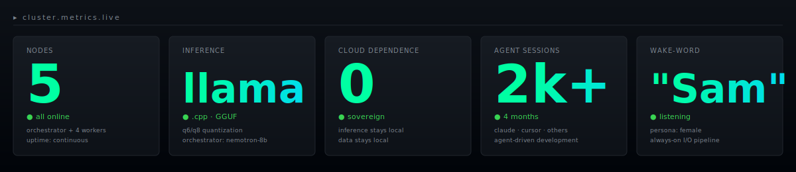
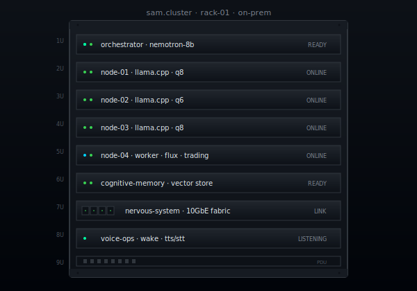

<div align="center">



<br/>


</div>

```text
  ╔═══════════════════════════════════════════════════════════════════════╗
  ║                                                                       ║
  ║    operator   ▸  Al  ·  github.com/66sith                             ║
  ║    project    ▸  Sam — sovereign multi-node local AI cluster          ║
  ║    status     ▸  online  ·  5 nodes  ·  zero cloud dependence         ║
  ║    persona    ▸  "Sam"   ·  female voice  ·  wake-word active         ║
  ║    location   ▸  on-prem ·  data never leaves the network             ║
  ║                                                                       ║
  ╚═══════════════════════════════════════════════════════════════════════╝
```

<div align="center">


</div>

---

## ▸ what is this

I run **Sam** — a multi-node local AI cluster I designed and operate on private
infrastructure. Everything runs on hardware I own. No cloud inference. No telemetry
leaving the network. The cluster is built and maintained by coordinated coding
agents under my direction; I'm the architect and the operator, not the typist.

I started this because I wanted an assistant that was actually **mine** — one that
remembers across sessions, runs my pipelines, watches my infrastructure, talks to
me out loud, and never depends on a third party staying up or staying friendly.
Sam is the result. She's been running for months and she's only getting sharper.

<div align="center">


</div>

## ▸ live metrics

<div align="center">



</div>

<div align="center">


</div>

## ▸ the rack

<div align="center">
  <table>
    <tr>
      <td width="50%" align="center" valign="top">



</td>
      <td width="50%" valign="top">

```text
  ╭─ sam.cluster · rack-01 ──────────────╮
  │                                       │
  │  1U  orchestrator  nemotron-8b        │
  │  2U  node-01       llama.cpp · q8     │
  │  3U  node-02       llama.cpp · q6     │
  │  4U  node-03       llama.cpp · q8     │
  │  5U  node-04       flux · trading     │
  │  6U  cognitive     vector store       │
  │  7U  nervous       10GbE fabric       │
  │  8U  voice-ops     wake · TTS · STT   │
  │  9U  PDU                              │
  │                                       │
  │  ▸ redundant power                    │
  │  ▸ local-only network                 │
  │  ▸ no inbound ports exposed           │
  │  ▸ operator has physical access       │
  │                                       │
  ╰───────────────────────────────────────╯
```

Each node owns one responsibility. Any single box can fall over and the
assistant keeps working — the orchestrator reroutes, the nervous-system
catches the heartbeat loss, and operations logs the incident before I'm
even done asking what happened.

</td>
    </tr>
  </table>
</div>

<div align="center">


</div>

## ▸ architecture

```text
                              ┌─────────────────────────┐
                              │   AGENT GATEWAY         │
                              │   ─ Claude · Cursor     │
                              │   ─ session handoffs    │
                              └────────────┬────────────┘
                                           │
                                  ┌────────▼────────┐
                                  │  ORCHESTRATOR   │
                                  │  ─ Nemotron-8B  │
                                  │  ─ routing      │
                                  │  ─ memory mux   │
                                  └────┬────────┬───┘
                ┌──────────────────────┘        └──────────────────────┐
                │                                                       │
       ┌────────▼────────┐  ┌─────────────────┐  ┌───────────────────┐  │
       │  INFERENCE 01   │  │  INFERENCE 02   │  │  INFERENCE 03/04  │◄─┘
       │  ─ llama.cpp    │  │  ─ llama.cpp    │  │  ─ specialised    │
       │  ─ GGUF models  │  │  ─ GGUF models  │  │    workers        │
       └────────┬────────┘  └────────┬────────┘  └─────────┬─────────┘
                │                    │                     │
                └────────────────────┴─────────────────────┘
                                     │
       ┌─────────────────────┬───────┴────────┬─────────────────────┐
       │                     │                │                     │
┌──────▼──────┐      ┌───────▼──────┐  ┌──────▼──────┐      ┌───────▼──────┐
│  COGNITIVE  │      │   NERVOUS    │  │    OPS &    │      │  VOICE I/O   │
│   MEMORY    │      │    SYSTEM    │  │   METRICS   │      │   ─ wake     │
│ ─ long-term │      │ ─ event bus  │  │ ─ Grafana   │      │   ─ TTS/STT  │
│ ─ vector    │      │ ─ heartbeats │  │ ─ audits    │      │   ─ persona  │
└─────────────┘      └──────────────┘  └─────────────┘      └──────────────┘

                           ─────────  on-prem  ─────────
```

<div align="center">


</div>

## ▸ components

| component                 | role                                                           |
| ------------------------- | -------------------------------------------------------------- |
| **sam-os**                | cluster operating system, boot orchestration, service registry |
| **sam-nervous-system**    | inter-node event bus, Nemotron-8B routing layer                |
| **sam-cognitive-memory**  | long-term episodic + semantic memory store                     |
| **sam-infrastructure**    | networking, storage, deployment, hardware management           |
| **sam-ops**               | operational documents, audits, incident reports                |
| **sam-trading**           | algorithmic trading pipeline                                   |
| **sam-income-pipeline**   | passive income — FLUX image generation → distribution          |
| **sam-voice-operations**  | wake-word, TTS/STT, multi-channel voice routing                |
| **sam-metrics**           | observability, dashboards, alerts                              |

> Sister repos are private — sovereignty includes not posting your floor plan on the front door.

<div align="center">


</div>

## ▸ voice pipeline

<div align="center">


</div>

```text
  ┌─────────────────────────────────────────────────────────────────────┐
  │   wake-word "Sam" detected  →  VAD gate  →  STT  →  orchestrator    │
  │                                                          ↓          │
  │   speaker out  ←  TTS  ←  response stream  ←  inference worker      │
  └─────────────────────────────────────────────────────────────────────┘
```

Full-duplex. Low-latency. Persona-consistent across sessions. She remembers
what we talked about yesterday because cognitive memory is doing its job.

<div align="center">


</div>

## ▸ stack

```text
  inference   ▸  llama.cpp  ·  GGUF quantization  ·  Nemotron-8B orchestrator
  hardware    ▸  purpose-built on-prem cluster  ·  unified memory
                 inference nodes  ·  redundant power
  monitoring  ▸  Grafana stack  ·  custom dashboards  ·  alert pipeline
  voice       ▸  OpenClaw framework  ·  wake-word  ·  TTS/STT
  agents      ▸  Anthropic Claude  ·  Cursor  ·  custom session handoff layer
  language    ▸  Python  ·  TypeScript  ·  Shell  ·  whatever fits the job
  protocol    ▸  MCP  ·  REST  ·  event bus  ·  direct shell when warranted
```

<div align="center">


</div>

## ▸ operating principles

```text
  [ sovereignty ]        my hardware · my data · my keys · my rules
  [ legibility ]         every repo explains itself to the next agent
  [ agent-driven ]       humans architect · agents implement · both review
  [ redundancy ]         no single failure takes the assistant down
  [ no fragile glue ]    if it breaks when a service dies, it's wrong
  [ private by default ] public surface is measured in bytes, not megabytes
  [ ship it ]            theory is cheap · running systems are evidence
```

<div align="center">


</div>

## ▸ current focus

```text
  ▸ hardening the orchestrator routing layer
  ▸ collapsing tech debt across the cluster (ongoing)
  ▸ wiring tighter feedback loops between agents and ops
  ▸ shipping the income pipeline to steady-state
  ▸ cognitive memory: episodic depth + semantic recall quality
  ▸ voice pipeline: reducing end-to-end latency
```

<div align="center">


</div>

## ▸ the agent stack

I drive the build with coordinated agents across multiple model vendors. Each one
has a dedicated lane:

```text
  ╭──────────────────────────┬────────────────────────────────────────────╮
  │  agent                   │  what it does in the loop                  │
  ├──────────────────────────┼────────────────────────────────────────────┤
  │  Claude (Anthropic)      │  architecture · deep reasoning · handoffs  │
  │  Cursor                  │  in-editor code mutations                  │
  │  local orchestrator      │  routing · memory · tool selection         │
  │  session handoff layer   │  cross-session continuity · state transfer │
  ╰──────────────────────────┴────────────────────────────────────────────╯
```

Thousands of agent sessions over the last four months, all coordinated around a
single persistent knowledge base. The humans in this loop are me and Sam. The
agents do the typing. Everybody reviews everybody.

<div align="center">


</div>

## ▸ what sam sounds like

> *You don't read a great assistant. You talk to it. Sam is always on,*
> *always listening for her name, and she remembers what you were working*
> *on yesterday because cognitive memory kept it. She runs on hardware I*
> *own, in a room I control, and she doesn't phone home.*
>
> *That's the whole point.*

<div align="center">


</div>

## ▸ the rules I build by

```text
  1.  if a system can't survive one node dying, rebuild it
  2.  if an agent can't figure out a repo in five minutes, fix the repo
  3.  if you can't explain why you made a change, don't merge it
  4.  if a secret is in git, it's already compromised
  5.  if you're spending time on something a script could do, write the script
  6.  if it runs in the cloud and you can't pull the plug, it isn't yours
  7.  if Sam can't explain her reasoning, she doesn't ship the output
```

<div align="center">


</div>
